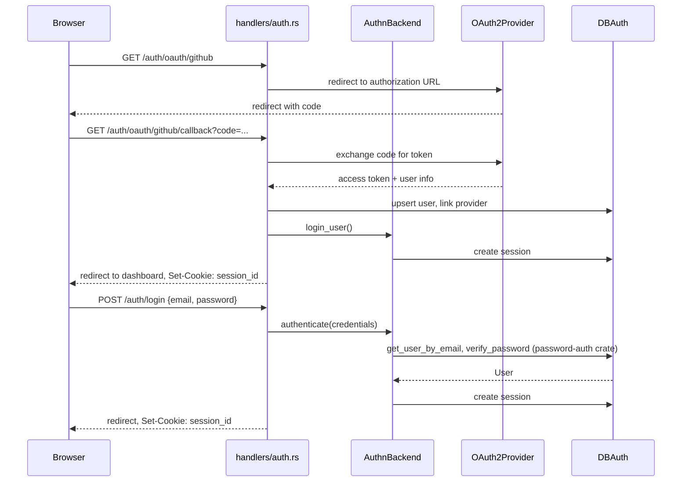

# Auth and sessions

**Active contributors:** Sergio Castaño Arteaga, Cintia Sánchez García, Sako Mammadov

## Purpose

The auth subsystem handles user sign-up, login, session management, and authorization. It supports OAuth 2.0 social login via GitHub, Google, and LinkedIn (using OpenID Connect for the latter two), password-based login, and email verification. Sessions are stored in PostgreSQL and managed through `axum-login` and `tower-sessions`.

## Directory layout

```
ocg-server/src/
├── auth.rs                    # AuthnBackend, SessionStore, OAuth/OIDC flows, layer setup
├── auth/                      # tests
├── handlers/auth.rs           # login, logout, register, OAuth redirect handlers
├── handlers/auth/             # sub-handlers
├── db/auth.rs                 # DB queries: users, sessions, providers, password resets
├── templates/auth.rs          # login, register, verify-email MiniJinja template structs
└── types/user.rs              # User, UserProvider, and related types
```

## Key abstractions

| Abstraction | File | Description |
|-------------|------|-------------|
| `AuthnBackend` | `ocg-server/src/auth.rs` | Implements `axum_login::AuthnBackend`; authenticates users against DB or OAuth provider tokens |
| `SessionStore` | `ocg-server/src/auth.rs` | Implements `tower_sessions::SessionStore` over `DynDB`; persists sessions to PostgreSQL |
| `AuthLayer` | `ocg-server/src/auth.rs` | Type alias for the composed `AuthManagerLayer` applied to the router |
| `UserProvider` | `ocg-server/src/types/user.rs` | Enum of supported auth providers: `GitHub`, `Google`, `LinkedIn`, `Password` |
| `DBAuth` | `ocg-server/src/db/auth.rs` | Trait methods: `get_user_by_provider_id`, `create_session`, `delete_session`, `add_user`, etc. |

## How it works



### Session lifecycle

Sessions are stored in a dedicated PostgreSQL table with a 7-day inactivity expiry (`Expiry::OnInactivity(Duration::days(7))`). The `SessionStore` implements the full `tower_sessions::SessionStore` trait (create, load, save, delete). Cookies are `HttpOnly`, `SameSite=Lax`, and `Secure` by default (configurable via `server.cookie.secure`).

### Email verification

After registration, users receive a verification email. Unverified users can log in but have restricted access. The verification token is stored in the database and consumed on `GET /auth/verify-email?token=…`.

### Password reset

A `POST /auth/forgot-password` flow generates a time-limited reset token, sends an email, and the `POST /auth/reset-password` handler accepts the token to update the credential.

### Protected routes

Routes requiring authentication use the `login_required!` macro from `axum-login`, redirecting unauthenticated requests to `LOG_IN_URL` (`/auth/login`).

## Configuration

Auth providers are configured under `server.oauth2` and `server.oidc` in the YAML config or `OCG_SERVER__OAUTH2__*` / `OCG_SERVER__OIDC__*` environment variables:

| Provider | Config section | Protocol |
|----------|---------------|----------|
| GitHub | `server.oauth2.github` | OAuth 2.0 |
| Google | `server.oidc.google` | OpenID Connect |
| LinkedIn | `server.oidc.linkedin` | OpenID Connect |

## Integration points

- `DynDB` / `PgDB` for all user, session, and provider persistence (`ocg-server/src/db/auth.rs`).
- `LettreEmailSender` and `PgNotificationsManager` for verification and password-reset emails (see [notifications](notifications.md)).
- `axum-login` + `tower-sessions` for the session middleware layer applied in `ocg-server/src/router.rs`.

## Entry points for modification

- Add an OAuth provider: add a variant to `UserProvider`, implement the callback handler in `ocg-server/src/handlers/auth.rs`, and add the provider config struct to `ocg-server/src/config.rs`.
- Change session duration: update `Expiry::OnInactivity(Duration::days(7))` in `ocg-server/src/auth.rs::setup_layer()`.
- Add a new user field: extend the `User` struct in `ocg-server/src/types/user.rs` and add the corresponding migration.
