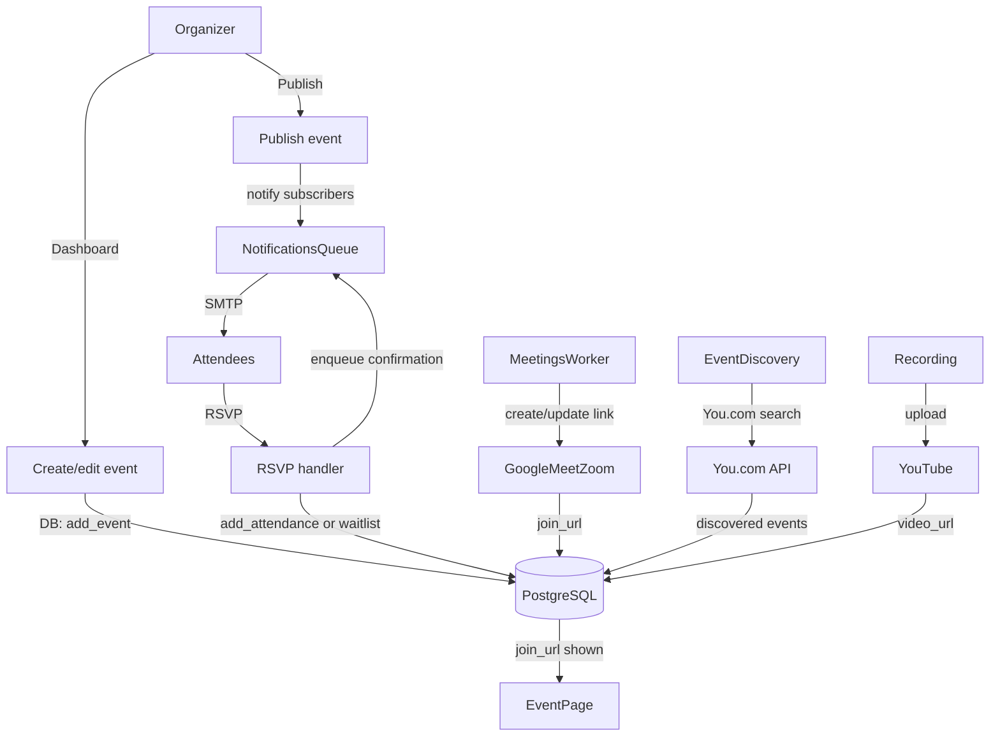

# Events

**Active contributors:** Sergio Castaño Arteaga, Cintia Sánchez García, Sako Mammadov

## Purpose

The events feature covers the full lifecycle of community events: creation, editing, publishing, RSVP and waitlist management, calendar integration, online meeting link provisioning, post-event recording publishing to YouTube, and AI-powered event discovery from external sources.

## Directory layout

```
ocg-server/src/
├── handlers/event.rs / event/        # HTTP handlers for event pages and RSVP actions
├── handlers/dashboard/               # dashboard handlers for creating/editing events
├── services/event_discovery.rs       # You.com-powered scheduled and on-demand discovery
├── services/meetings.rs              # Google Meet / Zoom link lifecycle manager
├── services/recording_publishing.rs  # YouTube upload worker for recordings
├── db/event.rs                       # DB queries: events, RSVPs, waitlist, attendance
├── templates/event.rs                # MiniJinja template structs for event pages
├── types/event.rs                    # Event, EventInput, EventKind, and related types
└── services/notifications/enqueue.rs # enqueue helpers for event notification templates
```

## Key abstractions

| Abstraction | File | Description |
|-------------|------|-------------|
| `DBEvent` | `ocg-server/src/db/event.rs` | Trait: get_event, add_event, update_event, publish_event, cancel_event, add_attendance, remove_attendance, waitlist operations |
| `ManualEventDiscovery` | `ocg-server/src/services/event_discovery.rs` | Trigger on-demand You.com discovery for a specific group from the dashboard |
| `MeetingsManager` | `ocg-server/src/services/meetings.rs` | Creates/updates Google Meet and Zoom links; syncs attendee lists |
| `RecordingPublishingManager` | `ocg-server/src/services/recording_publishing.rs` | Polls for completed recordings and publishes to YouTube |

## How it works



### Event lifecycle

1. **Draft** — created via dashboard; not visible to the public.
2. **Published** — organizer publishes; attendees can RSVP; notifications are sent.
3. **Canceled** — organizer cancels; cancellation notifications are sent to attendees.

### RSVP and waitlist

- When an event has `capacity`, new RSVPs beyond capacity are placed on a waitlist if `waitlist_enabled`.
- When an attendee cancels, the first waitlisted user is automatically promoted and notified.
- Organizer approval (`attendee_approval_required`) gates RSVPs.

### Meeting links

`MeetingsManager` handles Google Meet and Zoom API calls. Links are stored on the event record and shown to confirmed attendees. The manager can be extended to support additional providers by implementing `DynMeetingsProvider`.

### Event discovery (You.com)

`services/event_discovery.rs` runs a scheduled daily worker that queries the You.com search API for Baku community event pages and stores discovered events as drafts in the database. A `ManualEventDiscovery` handle is passed to dashboard handlers for on-demand group-specific runs.

### Recording publishing

`RecordingPublishingManager` polls for events that have a recorded session and uploads the recording to YouTube using configured credentials. The YouTube video URL is saved back to the event record.

## Notifications sent for events

See [notifications](notifications.md). Key templates: `EventPublished`, `EventCanceled`, `EventRescheduled`, `EventReminder`, `EventWelcome`, `EventInvitation`, `EventWaitlistJoined`, `EventWaitlistPromoted`, `EventRefundRequested`.

## Integration points

- [Payments](payments.md) — ticketed events use Stripe checkout; refunds go through `PgPaymentsManager`.
- [Notifications](notifications.md) — all event lifecycle emails are enqueued via `PgNotificationsManager`.
- [MCP server](../services/mcp-server.md) — `goup_create_event`, `goup_update_event`, `goup_search_events` tools.
- Google Meet / Zoom APIs via `services/meetings.rs`.
- YouTube Data API via `services/recording_publishing.rs`.

## Entry points for modification

- Add an event field: extend `EventInput` in `ocg-server/src/types/event.rs`, update `add_event`/`update_event` in `ocg-server/src/db/event.rs`, and add a migration.
- Add a meeting provider: implement `DynMeetingsProvider` and register it in `main.rs::start_meetings_workers()`.
- Change discovery schedule: update the sleep interval in `ocg-server/src/services/event_discovery.rs`.
