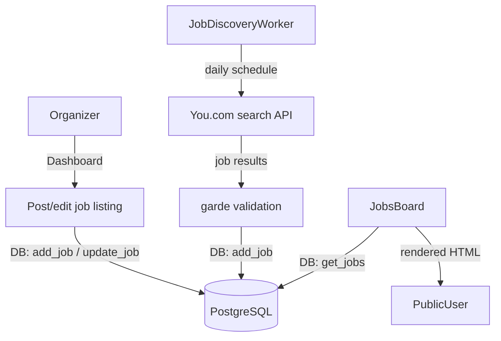

# Jobs

**Active contributors:** Sergio Castaño Arteaga, Cintia Sánchez García, Sako Mammadov

## Purpose

The jobs feature provides a community jobs board where group organizers can post job listings. A scheduled background worker (`job_discovery`) automatically discovers and imports job postings from user-approved external sources via the You.com search API.

## Directory layout

```
ocg-server/src/
├── handlers/site/jobs.rs                # public jobs board handler
├── handlers/dashboard/jobs.rs           # dashboard: post, edit, delete jobs
├── services/job_discovery.rs            # You.com-powered scheduled and on-demand discovery
├── db/jobs.rs                           # DB queries: get_jobs, add_job, update_job, delete_job
├── templates/site/                      # MiniJinja template structs for jobs pages
└── types/jobs.rs                        # JobInput, Job, and related types
```

## Key abstractions

| Abstraction | File | Description |
|-------------|------|-------------|
| `DBJobs` | `ocg-server/src/db/jobs.rs` | Trait: `get_jobs`, `add_job`, `update_job`, `delete_job`, `get_job_sources` |
| `ManualJobDiscovery` | `ocg-server/src/services/job_discovery.rs` | Trigger an on-demand user-scoped discovery run from the dashboard |
| `JobInput` | `ocg-server/src/types/jobs.rs` | Validated input struct for creating/updating a job listing |

## How it works



### Manual job posting

Group organizers post jobs through the dashboard at `/dashboard/alliance/:alliance_id/group/:group_id/jobs`. Fields are validated using the `garde` crate (`JobInput`) before being written to the database.

### Global job discovery

`services/job_discovery.rs` runs a daily background worker that:

1. Queries the database for user-approved job source configurations (`get_job_sources`).
2. Calls the You.com search API for each source query.
3. Validates each result against `JobInput` using `garde`.
4. Stores new jobs in the database (deduplication is handled by the DB layer).

A `ManualJobDiscovery` handle is injected into dashboard handlers so authorized users can trigger an immediate discovery run without waiting for the next scheduled cycle.

### Public jobs board

The `/jobs` page is handled by `ocg-server/src/handlers/site/jobs.rs`. It queries `DBJobs::get_jobs` and renders a paginated list of active listings.

## Integration points

- [Groups and alliances](groups-and-alliances.md) — jobs are scoped to groups; group admins manage them from the dashboard.
- [MCP server](../services/mcp-server.md) — `goup_search_jobs` tool searches the jobs API.
- You.com search API via `ocg-server/src/integrations/you_com.rs`.

## Entry points for modification

- Add a job field: extend `JobInput` in `ocg-server/src/types/jobs.rs`, update `DBJobs` in `ocg-server/src/db/jobs.rs`, and add a migration.
- Change discovery schedule: update the sleep interval in `ocg-server/src/services/job_discovery.rs`.
- Add a new job source: configure a source record in the database; the worker picks it up automatically.
