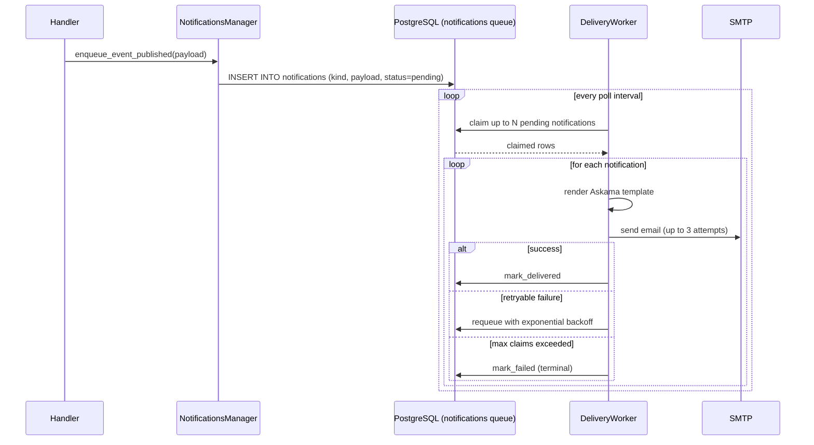

# Notifications

**Active contributors:** Sergio Castaño Arteaga, Cintia Sánchez García, Sako Mammadov

## Purpose

The notifications feature sends transactional email messages to users for platform events such as event RSVPs, event cancellations, team invitations, payment confirmations, and onboarding. Emails are composed from typed Askama templates and delivered asynchronously via SMTP using the Lettre crate.

## Directory layout

```
ocg-server/src/
├── services/notifications.rs              # PgNotificationsManager, LettreEmailSender, delivery worker
├── services/notifications/
│   ├── enqueue.rs                         # enqueue_* helper functions for each notification type
│   ├── payloads.rs                        # typed payload structs for each notification
│   └── tests.rs                           # integration tests
├── templates/notifications.rs             # Askama template structs (one per email type)
└── templates/notifications/              # .html Askama template files
```

## Key abstractions

| Abstraction | File | Description |
|-------------|------|-------------|
| `PgNotificationsManager` | `ocg-server/src/services/notifications.rs` | Queues notifications to PostgreSQL and runs the delivery worker |
| `DynNotificationsManager` | `ocg-server/src/services/notifications.rs` | `Arc<dyn NotificationsManager>` — used by handlers and other services |
| `LettreEmailSender` | `ocg-server/src/services/notifications.rs` | Wraps `lettre::AsyncSmtpTransport` for SMTP delivery |
| `DynEmailSender` | `ocg-server/src/services/notifications.rs` | `Arc<dyn EmailSender>` — allows mock replacement in tests |
| `DBNotifications` | `ocg-server/src/db/notifications.rs` | Trait: `enqueue_notification`, `claim_notifications`, `mark_delivered`, `requeue_failed` |

## How it works



### Delivery guarantees

- Notifications are written to the database before being sent, providing at-least-once delivery semantics.
- Failed deliveries are retried with exponential backoff: initial delay 1 minute, maximum 30 minutes.
- After `DELIVERY_MAX_CLAIMS` (10) attempts, a notification is marked terminal and will not be retried.
- A processing timeout of 15 minutes detects crashed worker instances and reclaims stuck notifications.

### Email templates

Each notification type has a corresponding Askama template struct in `ocg-server/src/templates/notifications.rs`. Templates are compiled at build time and render both HTML and plain-text parts.

| Template | Trigger |
|----------|---------|
| `EventPublished` | Organizer publishes an event |
| `EventCanceled` | Organizer cancels an event |
| `EventSeriesCanceled` | Organizer cancels an event series |
| `EventRescheduled` | Event time/location is changed |
| `EventReminder` | Pre-event reminder to registered attendees |
| `EventWelcome` | RSVP confirmation to new attendee |
| `EventInvitation` | Organizer sends a personal invitation |
| `EventSeriesPublished` | Event series is published |
| `EventWaitlistJoined` | User is placed on the waitlist |
| `EventWaitlistLeft` | User leaves the waitlist |
| `EventWaitlistPromoted` | Waitlisted user is promoted to confirmed |
| `EventCustom` | Ad-hoc message to event attendees |
| `EventRefundRequested` | Attendee requests a refund (sent to organizer) |
| `EventRefundApproved` | Organizer approves a refund |
| `EventRefundRejected` | Organizer rejects a refund |
| `GroupWelcome` | User joins a group |
| `GroupCustom` | Ad-hoc message to group members |
| `GroupTeamInvitation` | User is invited to a group team |
| `AllianceTeamInvitation` | User is invited to an alliance team |
| `EmailVerification` | New user email verification |
| `SiteOnboarding` | Post-registration onboarding email |
| `CoffeeMeetSuggestion` | Coffee meet suggestion for networking |
| `MockInterviewMatched` | Mock interview match notification |
| `IntentionalDatingIntroduction` | Intentional dating introduction |
| `CfsSubmissionUpdated` | CFS/talk proposal status update |
| `SessionProposalCoSpeakerInvitation` | Co-speaker invitation for a session proposal |
| `SpeakerWelcome` | New speaker welcome |
| `SpeakerSeriesWelcome` | Speaker series welcome |

## Configuration

SMTP settings are in the `email` section of the config:

| Config key | Env var | Description |
|------------|---------|-------------|
| `email.smtp_host` | `OCG_EMAIL__SMTP_HOST` | SMTP server hostname |
| `email.smtp_port` | `OCG_EMAIL__SMTP_PORT` | Port (defaults to 465 for SMTPS) |
| `email.smtp_username` | `OCG_EMAIL__SMTP_USERNAME` | SMTP auth username |
| `email.smtp_password` | `OCG_EMAIL__SMTP_PASSWORD` | SMTP auth password |
| `email.from_name` | `OCG_EMAIL__FROM_NAME` | Display name in From header |
| `email.from_address` | `OCG_EMAIL__FROM_ADDRESS` | From email address |

## Integration points

- [Events](events.md) — most notification types are enqueued by event handlers or the payments manager.
- [Payments](payments.md) — refund request/approval/rejection emails.
- [Auth](auth.md) — `EmailVerification` and `SiteOnboarding` templates.
- [Groups and alliances](groups-and-alliances.md) — `GroupWelcome`, `GroupTeamInvitation`, `AllianceTeamInvitation`.

## Entry points for modification

- Add a new notification type: create an Askama template struct in `ocg-server/src/templates/notifications.rs`, add an HTML template file, add a payload struct in `ocg-server/src/services/notifications/payloads.rs`, and add an `enqueue_*` helper in `ocg-server/src/services/notifications/enqueue.rs`.
- Change retry behavior: update `DELIVERY_MAX_CLAIMS`, `DELIVERY_REQUEUE_BASE_DELAY`, or `DELIVERY_REQUEUE_MAX_DELAY` constants in `ocg-server/src/services/notifications.rs`.
- Replace the SMTP provider: implement `EmailSender` for the new transport and update `setup_notifications_manager` in `ocg-server/src/main.rs`.
