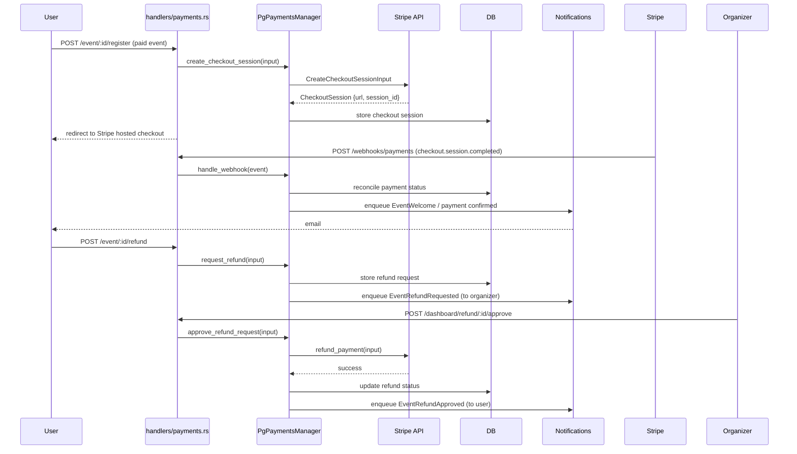

# Payments

**Active contributors:** Sergio Castaño Arteaga, Cintia Sánchez García, Sako Mammadov

## Purpose

The payments feature enables ticketed events with paid RSVP flows. It is built on a provider-agnostic model with Stripe as the currently supported backend. It covers checkout session creation, webhook event reconciliation, refund requests, organizer approval/rejection of refunds, and notification delivery at each step.

## Directory layout

```
ocg-server/src/
├── handlers/payments.rs / payments/         # webhook receiver, checkout redirect handlers
├── services/payments.rs                     # module re-exports
├── services/payments/
│   ├── manager.rs                           # PgPaymentsManager: checkout, refund, webhook logic
│   ├── provider.rs                          # DynPaymentsProvider trait + build_payments_provider
│   ├── notification_composer.rs             # builds notification payloads for payment events
│   └── webhook_reconciler.rs               # reconciles Stripe webhook events against DB state
├── db/payments.rs                           # DB queries: checkout sessions, refund requests, …
└── types/payments.rs                        # PaymentMode, PaymentProvider, CheckoutSession, …
```

## Key abstractions

| Abstraction | File | Description |
|-------------|------|-------------|
| `DynPaymentsManager` | `ocg-server/src/services/payments/manager.rs` | `Arc<dyn PaymentsManager>` — checkout, refund, and webhook operations |
| `PgPaymentsManager` | `ocg-server/src/services/payments/manager.rs` | PostgreSQL-backed manager; delegates provider calls to `DynPaymentsProvider` |
| `DynPaymentsProvider` | `ocg-server/src/services/payments/provider.rs` | `Arc<dyn PaymentsProvider>` — provider-specific checkout and refund API calls |
| `build_payments_provider` | `ocg-server/src/services/payments/provider.rs` | Factory; returns a Stripe provider when `payments.provider = stripe` is configured |
| `DBPayments` | `ocg-server/src/db/payments.rs` | Trait: checkout session CRUD, refund request CRUD, payment status updates |

## How it works



### Webhook reconciliation

`webhook_reconciler.rs` processes incoming Stripe webhook events. It matches them against stored checkout sessions by Stripe session ID and updates payment and attendance state. Unknown or duplicate events are safely ignored.

### Refund flow

Users request refunds from the event page. Refund requests are stored in the database and visible to group organizers in the dashboard. Organizers approve or reject through the dashboard; approval triggers a Stripe refund API call and sends a notification email to the user.

## Configuration

Payments are optional. They are enabled by setting `payments.provider = stripe` and providing API keys:

| Config key | Env var | Description |
|------------|---------|-------------|
| `payments.provider` | `OCG_PAYMENTS__PROVIDER` | `stripe` |
| `payments.stripe.secret_key` | `OCG_PAYMENTS__STRIPE__SECRET_KEY` | Stripe secret key |
| `payments.stripe.webhook_secret` | `OCG_PAYMENTS__STRIPE__WEBHOOK_SECRET` | Stripe webhook signing secret |

## Integration points

- [Events](events.md) — ticketed events trigger checkout session creation at RSVP time.
- [Notifications](notifications.md) — `EventRefundRequested`, `EventRefundApproved`, `EventRefundRejected` email templates.
- `ocg-server/src/config.rs` `PaymentsConfig` for Stripe credentials.

## Entry points for modification

- Add a payment provider: implement `PaymentsProvider` in a new file under `ocg-server/src/services/payments/`, return it from `build_payments_provider`, and add a config variant in `ocg-server/src/config.rs`.
- Change refund approval logic: edit `PgPaymentsManager::approve_refund_request` in `ocg-server/src/services/payments/manager.rs`.
- Add a new webhook event type: add a case to `webhook_reconciler.rs`.
