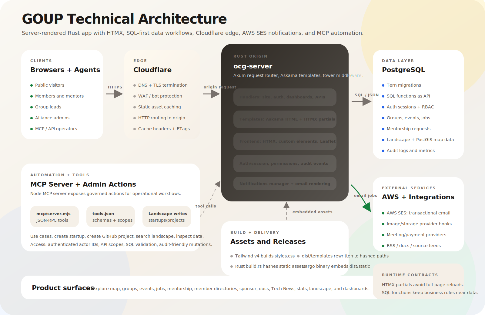

# GOUP Documentation

GOUP is a community platform for builders, founders, operators, mentors, and open source
contributors. It brings groups, events, member directories, jobs, landscape discovery, sponsorship,
and operational tooling into one product.

These docs are for people using GOUP, leading groups, managing alliances, sponsoring the community,
or contributing to the codebase.

## Start Here

| Goal | Best Starting Point |
| --- | --- |
| Get productive quickly | [Quickstart](getting-started/quickstart.md) |
| Choose the right dashboard | [Choose Your Dashboard](getting-started/choose-dashboard.md) |
| Discover groups and events | [Public Site Guide](guides/public-site.md) |
| Participate as a member | [Group Members Runbook](guides/group-members-runbook.md) |
| Lead a group | [Group Leads Runbook](guides/group-leads-runbook.md) |
| Run alliance operations | [Alliance Dashboard Guide](guides/alliance-dashboard.md) |
| Manage a group dashboard | [Group Dashboard Guide](guides/group-dashboard.md) |
| Run event operations | [Event Operations](guides/event-operations.md) |
| Contribute projects or code | [Project Contributors Runbook](guides/project-contributors-runbook.md) |
| Work on the application | [Development Guide](development.md) |

## Product Areas

### Public Site

The public site is where people learn what GOUP is, discover groups and events, browse the landscape,
read docs, view platform stats, find jobs, and learn about sponsorship.

Important pages:

- [Explore](/explore) for groups and events.
- [Jobs](/jobs) for public and member-only roles.
- [Landscape](/landscape) for startups and GitHub projects.
- [Stats](/stats) for platform activity and engagement.
- [Sponsor](/sponsor) for partnership inquiries.

### Member Experience

Members can manage their profile, join groups, RSVP to events, submit talks, respond to invitations,
save job interest, and publish mentorship availability for individuals or businesses.

Member-facing areas:

- [User Dashboard](/dashboard/user)
- [Profile settings](/dashboard/user?tab=account)
- [Alliance member directories](/goup/members)
- Public profile cards at `/profiles/{username}`

### Group Operations

Group leads use GOUP to manage events, members, sponsors, store items, member spotlights, team
permissions, and group-level communications.

Group dashboards include:

- Events and event series.
- Members and team access.
- Sponsors, store, and spotlights.
- Analytics and audit logs.

### Alliance Operations

Alliance admins manage brand identity, groups, taxonomy, regions, team access, landscape entries,
analytics, and public brand assets.

Alliance-level features include:

- Shared region and category taxonomy.
- Cross-group member directory.
- Public brand page.
- Landscape management.
- Alliance and group role permissions.

### Jobs, Mentorship, and Sponsorship

GOUP supports practical community opportunities:

- Members can post public or member-only jobs.
- Applicants can save interest so posters can follow up.
- Members can offer individual or business mentorship from their profile.
- Mentorship requests are tracked and emailed to mentors.
- Sponsors can submit inquiries after logging in.

## Architecture

GOUP is a server-rendered Rust application with progressive enhancement. The web app owns
the public site, dashboards, member workflows, and background notifications, while PostgreSQL
stores product data and exposes most business workflows through SQL functions.



## Technology Stack

| Layer | Technology |
| --- | --- |
| HTTP server | Rust, Axum, Tower middleware |
| Templates | Askama HTML templates |
| Interactivity | HTMX, custom elements, small JavaScript modules |
| Styling | Tailwind CSS utilities and project CSS |
| Database | PostgreSQL with PostGIS |
| Migrations | Tern plus SQL schema/function files |
| Auth | Email/password, GitHub OAuth2, LinkedIn OIDC |
| Background work | Rust services for notifications, email, meetings, payments |
| Testing | Rust tests, pgTAP, Playwright, frontend unit tests |
| Operations | EC2/systemd deployment, optional MCP server |

## Run Locally

Use the repository root for most commands.

### 1. Install Tools

Recommended local tools:

- Rust through `rustup`.
- PostgreSQL 15 or newer with PostGIS.
- `tern` for migrations.
- `just` for development commands.
- Node.js and npm for frontend and e2e tests.
- Tailwind CSS standalone CLI.

On macOS with Homebrew:

```bash
brew install rustup postgresql@17 postgis just go node watchexec
rustup-init
go install github.com/jackc/tern/v2@v2.3.2
```

Install the Tailwind standalone binary for your platform and make sure `tailwindcss` is on `PATH`.

### 2. Create Local Config

The `justfile` defaults to `$HOME/.config/ocg`.

```bash
mkdir -p "$HOME/.config/ocg"
```

Create `$HOME/.config/ocg/tern.conf`:

```toml
[database]
host = 127.0.0.1
port = 5432
database = ocg
user = postgres
password =
```

Create `$HOME/.config/ocg/server.yml` with matching database settings. Use
[Development Guide](development.md) for the fuller configuration shape.

### 3. Create and Migrate the Database

```bash
just db-create
just db-migrate
```

For a clean rebuild:

```bash
just db-recreate
```

### 4. Run the App

```bash
just server
```

Then open:

```text
http://localhost:9000
```

For automatic reloads while developing:

```bash
just server-watch
```

## Contributor Checks

Use focused checks while developing, then broader checks before opening a PR.

```bash
cargo check -p ocg-server
cargo clippy -p ocg-server --all-targets --all-features -- --deny warnings
uvx --python 3.12 djlint==1.39.2 --check --configuration ocg-server/templates/.djlintrc ocg-server/templates
node --check tests/e2e/site/common/header.spec.js
```

Database and full test commands:

```bash
just db-tests
just db-contract-tests
just server-tests
just frontend-unit-tests
just e2e-tests
```

## Deployment Notes

Production is currently a pull, migrate, release-build, restart flow on EC2:

```bash
cd ~/goup.vc
git pull origin main
cd database/migrations
TERN_CONF="$HOME/.config/ocg/tern.conf" ./migrate.sh
cd ~/goup.vc
nohup env CARGO_BUILD_JOBS=1 cargo build --release -p ocg-server > ~/goup-build.log 2>&1 &
tail -f ~/goup-build.log
sudo systemctl restart ocg-server
sudo systemctl status ocg-server --no-pager
curl -I http://127.0.0.1:9000
```

Release builds can take a while on small EC2 instances. A clean optimized Rust build near 15-20
minutes is not unusual when dependencies are not cached.

## Need Help?

Start with:

- [Troubleshooting](support/troubleshooting.md)
- [Frequently Asked Questions](support/faq.md)
- [Development Guide](development.md)
