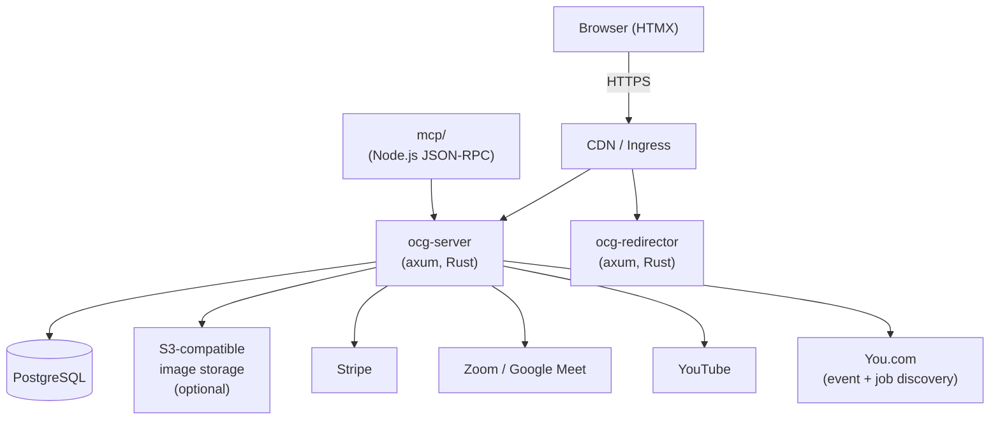
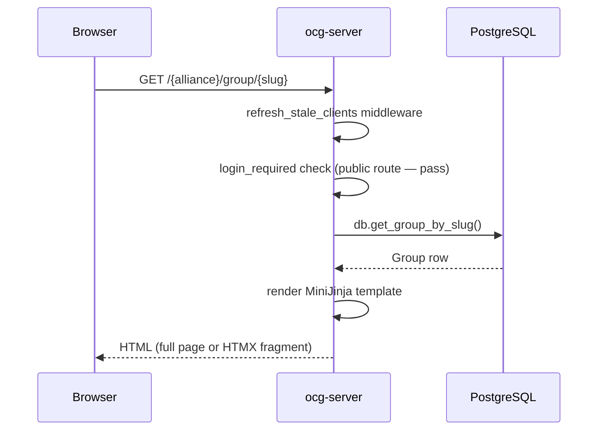

# System architecture

## High-level overview

## Components

### `ocg-server`

The main application server. It is a single binary built from `ocg-server/src/main.rs` that handles HTTP requests, background services, and all business logic.

**Routing** (`ocg-server/src/router.rs`)

The axum `Router` is assembled in `router::setup()`. Routes are divided into:

- Protected routes (wrapped with `login_required!` from `axum-login`)
- Dashboard routes, further split into alliance, group, and user sub-routers assembled in `router/dashboard.rs`
- API routes under `/api/v1/` assembled in `router/api.rs`
- Public routes (explore, jobs, landscape, wiki, profiles, etc.)

Conditional routes (Zoom webhooks, payment webhooks, email/GitHub/LinkedIn login) are added at runtime based on configuration.

**State** (`ocg-server/src/router.rs` — `State` struct)

The `State` struct is passed to every handler via axum's `FromRef` extraction. It holds:

- `db: DynDB` — trait-object database handle (`ocg-server/src/db.rs`)
- `image_storage: DynImageStorage` — trait-object storage handle
- `notifications_manager: DynNotificationsManager`
- `payments_manager: DynPaymentsManager`
- `meetings_cfg`, `payments_cfg`, `server_cfg` — loaded configuration
- `manual_event_discovery`, `manual_job_discovery` — optional background runners

**Handlers** (`ocg-server/src/handlers/`)

One subdirectory per domain: `alliance`, `auth`, `event`, `group`, `images`, `meetings`, `payments`, `site`, `dashboard`.

**Services** (`ocg-server/src/services/`)

Long-running background tasks started in `main.rs`:

| Module | Role |
|--------|------|
| `event_discovery.rs` | Scheduled You.com search for upcoming events |
| `job_discovery.rs` | Scheduled You.com search for job postings |
| `meetings.rs` | Meeting lifecycle, host pool, auto-end |
| `notifications.rs` | Outbound email notifications |
| `payments.rs` | Stripe payment processing |
| `recording_publishing.rs` | Google Drive → YouTube publishing |
| `images.rs` | Image upload and storage |

**Database layer** (`ocg-server/src/db/`)

Each domain has its own module (e.g., `db/alliance.rs`, `db/event.rs`). All modules implement methods on `PgDB` which satisfies the `DynDB` trait object. Queries use `deadpool-postgres` prepared statements.

**Configuration** (`ocg-server/src/config.rs`)

Configuration is loaded via Figment in `Config::new()`:
1. Compiled-in defaults (e.g., `server.addr = "127.0.0.1:9000"`, `log.format = "json"`)
2. Optional YAML file (path passed with `-c`)
3. `OCG_*` environment variables with `__` as nested-key separator

**Templates** (`ocg-server/src/templates/`, `ocg-server/templates/`)

MiniJinja templates are embedded in the binary. The template engine is initialised in `templates.rs`. HTMX is used for partial-page updates; the server detects `hx-request` and `x-ocg-fetch` headers to serve fragment or full-page responses.

**Validation** (`ocg-server/src/validation.rs`)

Input structs are annotated with `garde` rules and validated before being passed to the database layer.

### `ocg-redirector`

A minimal axum server defined in `ocg-redirector/`. It reads a YAML config and redirects a set of short paths to their canonical URLs. It shares the Cargo workspace but has no dependency on `ocg-server`.

### `mcp/`

A Node.js JSON-RPC server (`mcp/server.mjs`) implementing the Model Context Protocol. It exposes operational tools (defined in `mcp/tools.json`) that call the `ocg-server` HTTP API. It is intended for use by AI assistants and automation agents.

### Database migrations

SQL migrations live in `database/migrations/schema/` and are applied by `tern` via `database/migrations/migrate.sh`. The `justfile` provides `just db-migrate` and related tasks. The current schema is established by `0001_initial.sql`; subsequent files are numbered sequentially.

## Request flow

## Deployment

The application is deployed to Kubernetes using the Helm chart in `charts/goup/`. Static assets are embedded in the binary via `rust-embed`, so no separate static file server is needed.
