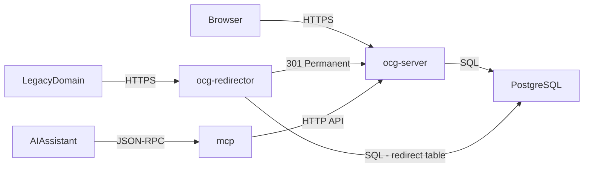

# Services overview

**Active contributors:** Sergio Castaño Arteaga, Cintia Sánchez García, Sako Mammadov

The GOUP Alliance platform is composed of three deployable services that work together to deliver the community website, handle legacy redirects, and expose platform data and operations through a machine-readable interface.

## Services

| Service | Language | Role |
|---------|----------|------|
| `ocg-server` | Rust (axum) | Main web server: HTML pages, auth, API, background workers |
| `ocg-redirector` | Rust (axum) | Lightweight HTTP 301 redirect service for legacy alliance URLs |
| `mcp` | Node.js (ESM) | MCP JSON-RPC server for AI assistant integrations |

## How they relate

`ocg-server` owns the database and all business logic. `ocg-redirector` reads a redirect-mapping table from the same PostgreSQL instance and issues permanent redirects to canonical `ocg-server` URLs. The `mcp` server wraps public `ocg-server` HTTP endpoints and internal shell/database tooling so AI assistants can query and modify platform data.

## Further reading

- [ocg-server](ocg-server.md) — main web server internals
- [ocg-redirector](ocg-redirector.md) — redirect service
- [mcp-server](mcp-server.md) — MCP JSON-RPC server
