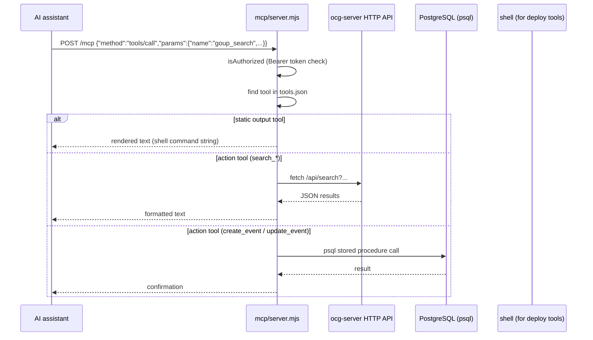

# MCP server

**Active contributors:** Sergio Castaño Arteaga, Cintia Sánchez García, Sako Mammadov

## Purpose

The `mcp/` directory contains a Node.js MCP (Model Context Protocol) JSON-RPC server. It exposes GOUP platform operations — search, event creation, deployment commands, and database utilities — as named tools that AI assistants (Claude, Cursor, VS Code Copilot, etc.) can call over HTTP.

## Directory layout

```
mcp/
├── package.json    # Node.js ESM package, no runtime dependencies
├── server.mjs      # HTTP server, JSON-RPC dispatcher, tool runner
├── tools.json      # tool definitions (name, description, inputSchema, output/action)
└── README.md
```

## How it works

`server.mjs` starts a plain Node.js `http.createServer`. All MCP communication goes through `POST /mcp`. The server also exposes:

- `GET /health` — liveness check
- `GET /tools` — list registered tools



### Tool dispatch

Each entry in `tools.json` has either an `output.text` field (static template, rendered with `{{ variable }}` interpolation) or an `action` string. Actions are dispatched in `server.mjs::runAction()`:

| Action | Description |
|--------|-------------|
| `create_event` | Calls `add_event` PostgreSQL function |
| `update_event` | Calls `update_event` PostgreSQL function |
| `search_all` | Parallel search across events, groups, jobs, landscape, wiki |
| `search_groups` | Query `ocg-server` groups API |
| `search_events` | Query `ocg-server` events API |
| `search_members` | Query `ocg-server` members API |
| `search_teams` | Query `ocg-server` teams API |
| `search_jobs` | Query `ocg-server` jobs API |
| `search_landscape` | Query `ocg-server` landscape API |
| `create_startup` | Insert landscape entry of kind `startup` |
| `create_github_project` | Insert landscape entry of kind `github_project` |
| `search_wiki` | Fetch and filter RSS feeds from curated wiki sources |
| `submit_talk` | Submit a talk/CFS proposal |

### Registered tools (tools.json)

| Tool name | Mode | Description |
|-----------|------|-------------|
| `goup_deploy_after_pull` | static | Full deploy sequence after `git pull` on EC2 |
| `goup_run_migrations` | static | Run tern migrations |
| `goup_release_build_background` | static | Background Cargo release build + log tail |
| `goup_service_status` | static | systemctl status + journalctl + curl health |
| `goup_create_event` | action | Create a draft event via DB stored procedure |
| `goup_update_event` | action | Update an existing event via DB stored procedure |
| `goup_search` | action | Global search across all content |
| `goup_search_groups` | action | Search groups |
| `goup_search_events` | action | Search events |
| `goup_search_members` | action | Search members |
| `goup_search_teams` | action | Search teams |
| `goup_search_jobs` | action | Search jobs |
| `goup_search_landscape` | action | Search landscape entries |
| `goup_create_startup` | action | Create a startup landscape entry |
| `goup_create_github_project` | action | Create a GitHub project landscape entry |
| `goup_search_wiki` | action | Search curated RSS wiki sources |
| `goup_submit_talk` | action | Submit a CFS/talk proposal |

Static tools return shell command strings (useful for AI-assisted deployment workflows). Action tools require network access to `ocg-server` or direct database access.

## Configuration

Environment variables:

| Variable | Default | Description |
|----------|---------|-------------|
| `PORT` / `MCP_PORT` | `8787` | Listening port |
| `HOST` / `MCP_HOST` | `0.0.0.0` | Bind address |
| `MCP_BEARER_TOKEN` | (empty) | Bearer token; if set, all requests must include `Authorization: Bearer <token>` |
| `MCP_ENABLE_MUTATIONS` | `false` | Set to `true` to allow `create_event` and `update_event` |
| `DATABASE_URL` / `TERN_CONF` | — | Database connection for mutation tools |
| `OCG_API_BASE_URL` | — | Base URL of `ocg-server` for search tools |

## Integration points

- Calls public and authenticated `ocg-server` HTTP API endpoints for all search operations.
- Connects directly to PostgreSQL for mutation actions when `MCP_ENABLE_MUTATIONS=true`.
- Fetches external RSS feeds for `search_wiki`.

## Entry points for modification

- Add a new tool: append an entry to `mcp/tools.json` and, if it requires runtime logic, add a case to `runAction()` in `mcp/server.mjs`.
- Change authentication: modify `isAuthorized()` in `mcp/server.mjs`.
- Add a new wiki RSS source: add to the `WIKI_SECTIONS` array in `mcp/server.mjs`.
