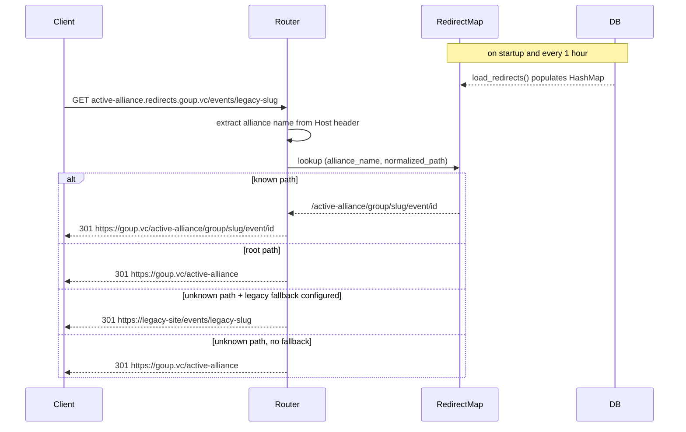

# ocg-redirector

**Active contributors:** Sergio Castaño Arteaga, Cintia Sánchez García, Sako Mammadov

## Purpose

`ocg-redirector` is a small Rust/axum service that issues HTTP 301 permanent redirects from legacy alliance-specific domains (e.g., `active-alliance.redirects.goup.vc`) to canonical `ocg-server` URLs. It is designed to be stateless at request time: redirect mappings are loaded from the same PostgreSQL database used by `ocg-server` and cached in memory, refreshed every hour.

## Directory layout

```
ocg-redirector/
├── Cargo.toml
├── Dockerfile
└── src/
    ├── main.rs      # entry point, periodic redirect refresh
    ├── config.rs    # Figment config (YAML + env vars)
    ├── db.rs        # load_redirects() query
    └── router.rs    # axum router, redirect handler, helpers
```

## Key abstractions

| Abstraction | File | Description |
|-------------|------|-------------|
| `Redirects` | `ocg-redirector/src/router.rs` | `HashMap<String, AllianceRedirects>` keyed by alliance name |
| `AllianceRedirects` | `ocg-redirector/src/router.rs` | Per-alliance redirect map plus optional legacy fallback URL |
| `PgDB` | `ocg-redirector/src/db.rs` | Thin wrapper around a deadpool-postgres pool; exposes `load_redirects()` |
| `Config` | `ocg-redirector/src/config.rs` | `base_redirect_url` and `redirect_host_suffix` for subdomain parsing |

## How it works



Redirect resolution steps:

1. Parse the `Host` header to extract the alliance name (subdomain before the configured `redirect_host_suffix`).
2. Normalize the request path (strip trailing slashes).
3. Look up the normalized path in the in-memory `Redirects` map.
4. Return a `301 Permanent Redirect` to the resolved target.

The refresh task is a plain `tokio::spawn` loop sleeping for `REDIRECT_REFRESH_INTERVAL` (1 hour). Failures are logged but do not crash the server; the previous mapping remains active.

## Configuration

Accepted via YAML or environment variables. Key fields:

| Field | Description |
|-------|-------------|
| `server.base_redirect_url` | Canonical base URL of `ocg-server` (e.g., `https://goup.vc`) |
| `server.redirect_host_suffix` | Suffix stripped from the `Host` header (e.g., `redirects.goup.vc`) |
| `db.*` | deadpool-postgres connection settings, same schema as `ocg-server` |

## Integration points

- Reads the redirect mapping table from the PostgreSQL database shared with [ocg-server](ocg-server.md).
- Redirect targets are canonical URLs served by `ocg-server`.

## Entry points for modification

- Change the refresh interval: update `REDIRECT_REFRESH_INTERVAL` in `ocg-redirector/src/main.rs`.
- Change redirect resolution logic: edit the `redirect` handler in `ocg-redirector/src/router.rs`.
- Change the database query that builds the mapping: edit `ocg-redirector/src/db.rs`.
