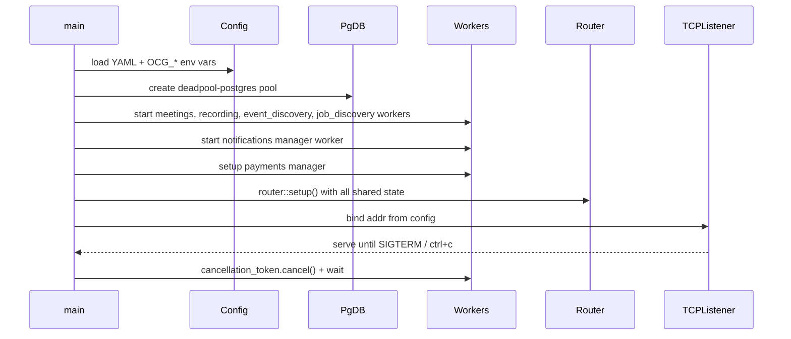
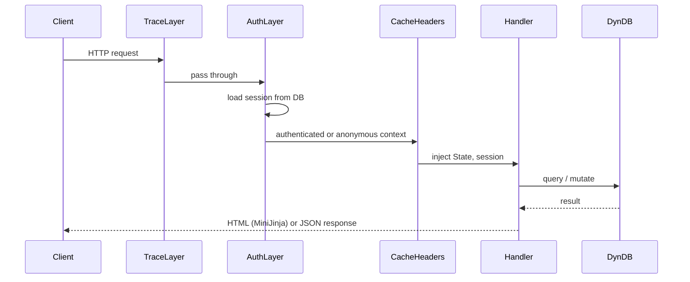

# ocg-server

**Active contributors:** Sergio Castaño Arteaga, Cintia Sánchez García, Sako Mammadov

## Purpose

`ocg-server` is the main Rust web server for the GOUP Alliance platform. It serves all HTML pages using server-side rendering with MiniJinja templates, implements OAuth and password authentication, manages background workers for event discovery, job discovery, meetings, notifications, and payments, and exposes both public and authenticated HTTP endpoints.

## Directory layout

```
ocg-server/
├── Cargo.toml
├── Dockerfile
├── Dockerfile.dev
├── build.rs                    # embeds OCG_COMMIT_SHA at compile time
├── src/
│   ├── main.rs                 # entry point, wires all subsystems
│   ├── config.rs               # Figment config (YAML + OCG_* env vars)
│   ├── router.rs               # axum router, routes, middleware setup
│   ├── router/
│   │   ├── api.rs              # /api/* routes
│   │   └── dashboard.rs        # /dashboard/* routes
│   ├── auth.rs                 # auth layer setup, session store, OAuth/OIDC flows
│   ├── auth/                   # tests
│   ├── db.rs                   # DynDB trait + PgDB implementation
│   ├── db/                     # per-domain DB modules (alliance, auth, event, group, …)
│   ├── handlers.rs             # re-exports for handlers
│   ├── handlers/               # HTTP handler modules per domain
│   │   ├── alliance.rs / alliance/
│   │   ├── auth.rs / auth/
│   │   ├── dashboard/          # per-section dashboard handlers
│   │   ├── event.rs / event/
│   │   ├── group.rs / group/
│   │   ├── images.rs / images/
│   │   ├── meetings.rs / meetings/
│   │   ├── payments.rs / payments/
│   │   ├── site.rs / site/     # public site pages (home, explore, landscape, jobs, …)
│   │   ├── api/                # JSON API handlers
│   │   ├── extractors.rs       # custom axum extractors
│   │   └── error.rs            # shared error types
│   ├── services.rs             # re-exports for services
│   ├── services/               # background workers
│   │   ├── event_discovery.rs  # You.com-powered event scraping
│   │   ├── job_discovery.rs    # You.com-powered job scraping
│   │   ├── meetings.rs         # Google Meet / Zoom link management
│   │   ├── notifications.rs    # email delivery queue worker
│   │   ├── payments.rs         # Stripe checkout and refund manager
│   │   ├── recording_publishing.rs  # YouTube upload worker
│   │   └── images.rs           # image storage (DB or S3)
│   ├── templates.rs            # re-exports for templates
│   ├── templates/              # MiniJinja template structs per domain
│   ├── types.rs                # re-exports for domain types
│   ├── types/                  # domain type definitions
│   ├── integrations.rs / integrations/  # You.com search client
│   ├── activity_tracker.rs     # tracks user page activity
│   ├── validation.rs           # garde validation helpers
│   └── util.rs                 # shared utilities
├── templates/                  # HTML templates (.jinja)
└── static/                     # static assets embedded at build time
```

## Key abstractions

| Abstraction | File | Description |
|-------------|------|-------------|
| `DynDB` | `ocg-server/src/db.rs` | `Arc<dyn …>` trait object composed of all domain DB sub-traits |
| `PgDB` | `ocg-server/src/db.rs` | Concrete `deadpool-postgres` implementation of `DynDB` |
| `AuthnBackend` | `ocg-server/src/auth.rs` | `axum-login` backend; supports GitHub/Google/LinkedIn OAuth2 and OpenID Connect |
| `SessionStore` | `ocg-server/src/auth.rs` | Database-backed `tower-sessions` session store |
| `Config` | `ocg-server/src/config.rs` | Figment root config; merged from YAML file and `OCG_*` env vars |
| `BackgroundTasks` | `ocg-server/src/main.rs` | `CancellationToken` + `TaskTracker` wiring for all background workers |
| `PgNotificationsManager` | `ocg-server/src/services/notifications.rs` | Queues and delivers email notifications via Lettre/SMTP |
| `PgPaymentsManager` | `ocg-server/src/services/payments/manager.rs` | Checkout, refund, and webhook reconciliation logic |
| `MeetingsManager` | `ocg-server/src/services/meetings.rs` | Manages Google Meet and Zoom link lifecycles |
| `ManualEventDiscovery` | `ocg-server/src/services/event_discovery.rs` | On-demand You.com event scraping trigger |
| `ManualJobDiscovery` | `ocg-server/src/services/job_discovery.rs` | On-demand You.com job scraping trigger |

## How it works

### Startup sequence



### Request lifecycle



### Routing structure

The router is built in `ocg-server/src/router.rs`. Routes are grouped as:

- **Public site** (`/`, `/explore`, `/jobs`, `/landscape`, `/search`, …) — rendered with shared cache headers
- **Auth** (`/auth/login`, `/auth/oauth/github`, `/auth/oauth/google`, …)
- **Alliance pages** (`/:alliance_name`, `/:alliance_name/group/:group_name/…`)
- **Event pages** (`/:alliance_name/group/:group_name/event/:event_id/…`)
- **Dashboard** (`/dashboard/…`) — login-required, per-alliance/group management
- **API** (`/api/…`) — JSON endpoints used by HTMX partial updates
- **Images** (`/images/…`)
- **Static assets** — embedded via `rust-embed`, served with long-lived cache headers

Middleware layers (inner to outer): `TraceLayer`, `SetResponseHeaderLayer` (cache/commit-SHA headers), `AuthManagerLayer` (axum-login), `MessagesManagerLayer` (flash messages).

## Auth system

See [features/auth.md](../features/auth.md) for a detailed walkthrough. At the router level, protected routes use `login_required!(AuthnBackend, login_url = LOG_IN_URL)` from axum-login.

## Configuration

`ocg-server` accepts a YAML config file (`-c path/to/config.yaml`) and environment variables prefixed `OCG_` with `__` as a nesting separator. Required fields: `db`, `email`, `server.addr`, `server.base_url`. Optional sections: `meetings`, `payments`, `recording_publishing`, `integrations.you_com`.

## Integration points

| Integration | Config section | Purpose |
|-------------|---------------|---------|
| PostgreSQL | `db` | All persistence via deadpool-postgres |
| SMTP | `email` | Notification delivery via Lettre |
| GitHub OAuth2 | `server.oauth2.github` | Social login |
| Google OIDC | `server.oidc.google` | Social login |
| LinkedIn OIDC | `server.oidc.linkedin` | Social login |
| Google Meet | `meetings.google_meet` | Meeting link provisioning |
| Zoom | `meetings.zoom` | Meeting link provisioning |
| Stripe | `payments.provider = stripe` | Checkout and refunds |
| YouTube | `recording_publishing.youtube` | Post-event recording upload |
| You.com | `integrations.you_com` | AI-powered event and job discovery |
| S3 | `images.provider = s3` | Image storage (alternative to DB) |

## Entry points for modification

- Add a new page: create a handler in `ocg-server/src/handlers/site/` and register it in `ocg-server/src/router.rs`.
- Add a background worker: implement the worker in `ocg-server/src/services/`, start it in `main.rs::main()`.
- Add a DB operation: implement the method on the appropriate sub-trait in `ocg-server/src/db/` and add it to the `DynDB` composed trait in `ocg-server/src/db.rs`.
- Add a new config key: add the field to the relevant struct in `ocg-server/src/config.rs` and document the `OCG_` env variable.
